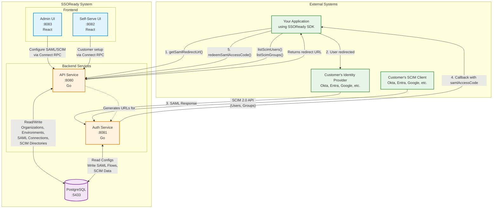

<div align="center">
  <h1>SSOReady</h1>
  <a href="https://github.com/ssoready/ssoready-typescript"></a>
  <a href="https://github.com/ssoready/ssoready-python"></a>
  <a href="https://github.com/ssoready/ssoready-go"></a>
  <a href="https://github.com/ssoready/ssoready-java"></a>
  <a href="https://github.com/ssoready/ssoready-csharp"></a>
  <a href="https://github.com/ssoready/ssoready-ruby"></a>
  <a href="https://github.com/ssoready/ssoready-php"></a>
  <a href="https://github.com/ssoready/ssoready/blob/main/LICENSE"></a>
  <a href="https://github.com/ssoready/ssoready/stargazers"></a>
  <br />
  <br />
  <a href="https://ssoready.com/docs/saml/saml-quickstart">SAML Quickstart</a>
  <span>&nbsp;&nbsp;•&nbsp;&nbsp;</span>
  <a href="https://ssoready.com/docs/scim/scim-quickstart">SCIM Quickstart</a>
  <span>&nbsp;&nbsp;•&nbsp;&nbsp;</span>
  <a href="https://ssoready.com">Website</a>
  <span>&nbsp;&nbsp;•&nbsp;&nbsp;</span>
  <a href="https://ssoready.com/docs">Docs</a>
  <span>&nbsp;&nbsp;•&nbsp;&nbsp;</span>
  <a href="https://ssoready.com/blog">Blog</a>
  <br />
  <hr />
</div>

## What is SSOReady?

[SSOReady](https://ssoready.com) ([YC
W24](https://www.ycombinator.com/companies/ssoready)) is an **open-source,
straightforward** way to add SAML and SCIM support to your product:

* **[SSOReady SAML](https://ssoready.com/docs/saml/saml-quickstart)**: Everything you need to add SAML ("Enterprise SSO") to your product today.
* **[SSOReady SCIM](https://ssoready.com/docs/scim/scim-quickstart)**: Everything you need to add SCIM ("Enterprise Directory Sync") to your product today.
* **[Self-serve Setup UI](https://ssoready.com/docs/idp-configuration/enabling-self-service-configuration-for-your-customers)**:
  A hosted UI your customers use to onboard themselves onto SAML and/or
  SCIM.

**With SSOReady, you're in control:**

* SSOReady can be used in *any* application, regardless of what stack you use.
  We provide language-specific SDKs as thin wrappers over a [straightforward
  HTTP
  API](https://ssoready.com/docs/api-reference/saml/redeem-saml-access-code):
  * [SSOReady-TypeScript](https://github.com/ssoready/ssoready-typescript)
  * [SSOReady-Python](https://github.com/ssoready/ssoready-python)
  * [SSOReady-Go](https://github.com/ssoready/ssoready-go)
  * [SSOReady-Java](https://github.com/ssoready/ssoready-java)
  * [SSOReady-C#](https://github.com/ssoready/ssoready-csharp)
  * [SSOReady-Ruby](https://github.com/ssoready/ssoready-ruby)
  * [SSOReady-PHP](https://github.com/ssoready/ssoready-php)
* SSOReady is just an authentication middleware layer. SSOReady doesn’t "own" your users or require any changes to your users database.
* You can use our cloud-hosted instance or [self-host yourself](https://ssoready.com/docs/self-hosting-ssoready), with the Enterprise plan giving you SLA'd support either way.

**SSOReady can be extended with these products, available on the [Enterprise plan](https://ssoready.com/pricing):**

* [Custom Domains & Branding](https://ssoready.com/docs/ssoready-concepts/environments#custom-domains): Run
  SSOReady on a domain you control, and make your entire SAML/SCIM experience on-brand.
* [Management API](https://ssoready.com/docs/management-api): Completely automate everything about SAML
  and SCIM programmatically at scale.
* [Enterprise Support](https://ssoready.com/pricing): SLA'd support, including for self-hosted deployments.

## Getting started

The fastest way to get started with SSOReady is to follow the quickstart for
what you want to add support for:

* [SAML Quickstart](https://ssoready.com/docs/saml/saml-quickstart)
* [SCIM Quickstart](https://ssoready.com/docs/scim/scim-quickstart)

Most folks implement SAML and SCIM in an afternoon. It only takes two lines of
code.

## Architecture

SSOReady consists of five main components that work together to provide SAML and SCIM functionality:



### Component Responsibilities

| Component | Purpose | Technology |
|-----------|---------|------------|
| **API Service** | REST API for managing organizations, environments, SAML connections, and SCIM directories. Handles all administrative operations and SDK requests. | Go + Connect RPC |
| **Auth Service** | Handles SAML authentication flows and SCIM provisioning endpoints. Processes SAML assertions from IdPs and serves as SCIM 2.0 server. | Go |
| **Admin UI** | Management interface for configuring SAML/SCIM settings, viewing logs, and managing organizations. | React + TypeScript |
| **Self-Serve UI** | Customer-facing interface allowing your customers to configure their own SAML/SCIM connections without developer involvement. | React + TypeScript |
| **PostgreSQL** | Stores all configuration data, SAML flows, SCIM user/group data, and audit logs. | PostgreSQL 15.3 |

### Data Flow Examples

**SAML Authentication Flow:**
1. Your app calls `getSamlRedirectUrl()` via SDK → API Service
2. API returns IdP redirect URL
3. User is redirected to customer's IdP
4. IdP authenticates user and sends SAML assertion → Auth Service
5. Auth Service validates assertion and redirects to your callback URL with `samlAccessCode`
6. Your app calls `redeemSamlAccessCode()` → API Service returns user email

**SCIM Provisioning Flow:**
1. Customer's IdP pushes user/group data via SCIM 2.0 → Auth Service
2. Auth Service validates and stores in PostgreSQL
3. Your app periodically calls `listScimUsers()` → API Service returns synced users

## Local development

To run SSOReady locally for development or testing:

1. Clone this repository
2. Run `./bin/dev-setup` to set up your environment
3. Run `./bin/dev-seed` to create development user accounts (optional)
4. Run `./bin/dev-start` to start all services

See [DEVELOPMENT.md](./DEVELOPMENT.md) for complete setup instructions, architecture details, and troubleshooting guides.

## How SSOReady works

This section provides a high-level overview of how SSOReady works, and how it's possible to implement SAML and SCIM in
just an afternoon. For a more thorough introduction, visit the [SAML
quickstart](https://ssoready.com/docs/saml/saml-quickstart) or the [SCIM
quickstart](https://ssoready.com/docs/scim/scim-quickstart).

### SAML in two lines of code

SAML (aka "Enterprise SSO") consists of two steps: an *initiation* step where you redirect your users to their corporate
identity provider, and a *handling* step where you log them in once you know who they are.

To initiate logins, you'll use SSOReady's [Get SAML Redirect
URL](https://ssoready.com/docs/api-reference/saml/get-saml-redirect-url) endpoint:

```typescript
// this is how you implement a "Sign in with SSO" button
const { redirectUrl } = await ssoready.saml.getSamlRedirectUrl({
  // the ID of the organization/workspace/team (whatever you call it)
  // you want to log the user into
  organizationExternalId: "..."
});

// redirect the user to `redirectUrl`...
```

You can use whatever your preferred ID is for organizations (you might call them "workspaces" or "teams") as your
`organizationExternalId`. You configure those IDs inside SSOReady, and SSOReady handles keeping track of that
organization's SAML and SCIM settings.

To handle logins, you'll use SSOReady's [Redeem SAML Access
Code](https://ssoready.com/docs/api-reference/saml/redeem-saml-access-code) endpoint:

```typescript
// this goes in your handler for POST /ssoready-callback
const { email, organizationExternalId } = await ssoready.saml.redeemSamlAccessCode({
  samlAccessCode: "saml_access_code_..."
});

// log the user in as `email` inside `organizationExternalId`...
```

You configure the URL for your `/ssoready-callback` endpoint in SSOReady.

### SCIM in one line of code

SCIM (aka "Enterprise directory sync") is basically a way for you to get a list of your customer's employees offline.

To get a customer's employees, you'll use SSOReady's [List SCIM
Users](https://ssoready.com/docs/api-reference/scim/list-scim-users) endpoint:

```typescript
const { scimUsers, nextPageToken } = await ssoready.scim.listScimUsers({
  organizationExternalId: "my_custom_external_id"
});

// create users from each scimUser
for (const { email, deleted, attributes } of scimUsers) {
  // ...
}
```

## Philosophy

We believe everyone that sells software to businesses should support enterprise
SSO. It's a huge security win for your customers.

The biggest problem with enterprise SSO is that it's way too confusing. Most
open-source SAML libraries are underdocumented messes. Every time I've tried to
implement SAML, I was constantly looking for someone to just tell me what in the
_world_ I was supposed to concretely do.

We believe that more people will implement enterprise SSO if you make it obvious
and secure by default. We are obsessed with giving every developer clarity and
security here.

Also, we believe randomly pumping up prices on security software like this is
totally unacceptable. MIT-licensing the software gives you insurance against us
ever doing that. Do whatever you want with the code. Fork us if we ever
misbehave.

## Security

If you have a security issue to report, please contact us at
security@ssoready.com.
