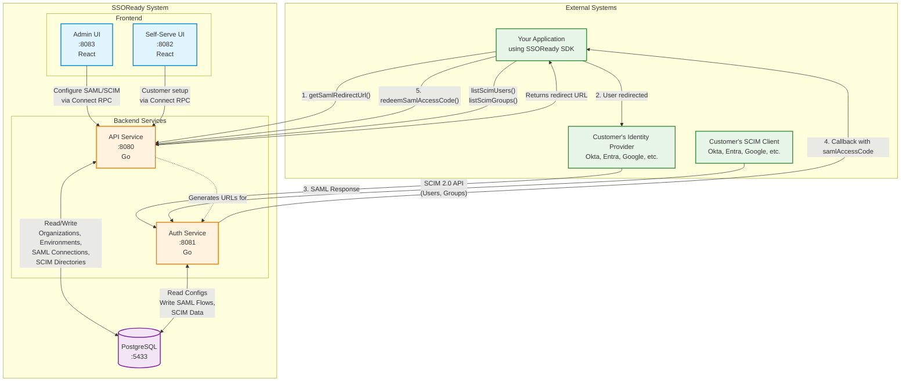

# SSORead
 

## What is SSOReady?

Fork of [SSOReady](https://ssoready.com) - an **open-source,
straightforward** way to add SAML and SCIM support to your product:

* **[SSOReady SAML](https://ssoready.com/docs/saml/saml-quickstart)**: Everything you need to add SAML ("Enterprise SSO") to your product today.
* **[SSOReady SCIM](https://ssoready.com/docs/scim/scim-quickstart)**: Everything you need to add SCIM ("Enterprise Directory Sync") to your product today.
* **[Self-serve Setup UI](https://ssoready.com/docs/idp-configuration/enabling-self-service-configuration-for-your-customers)**:
  A hosted UI your customers use to onboard themselves onto SAML and/or
  SCIM.

## Architecture

SSOReady consists of five main components that work together to provide SAML and SCIM functionality:

### Component Responsibilities

| Component | Purpose | Technology | URL |
|-----------|---------|------------|-----|
| **API Service** | REST API for managing organizations, environments, SAML connections, and SCIM directories. Handles all administrative operations and SDK requests. | Go + Connect RPC | identity-api.govai.com |
| **Auth Service** | Handles SAML authentication flows and SCIM provisioning endpoints. Processes SAML assertions from IdPs and serves as SCIM 2.0 server. | Go | identity-auth.govai.com |
| **App (Admin) UI** | Management interface for configuring SAML/SCIM settings, viewing logs, and managing organizations. Referred to as app in code. | React + TypeScript | identity-app.govai.com |
| **Self-Serve UI** | Customer-facing interface allowing your customers to configure their own SAML/SCIM connections without developer involvement. Referred to as admin in code. | React + TypeScript | identity-setup.govai.com |
| **PostgreSQL** | Stores all configuration data, SAML flows, SCIM user/group data, and audit logs. | PostgreSQL | - |

### Data Flow Examples

**SAML Authentication Flow:**
1. Your app calls `getSamlRedirectUrl()` via SDK → API Service
2. API returns IdP redirect URL
3. User is redirected to customer's IdP
4. IdP authenticates user and sends SAML assertion → Auth Service
5. Auth Service validates assertion and redirects to your callback URL with `samlAccessCode`
6. Your app calls `redeemSamlAccessCode()` → API Service returns user email

**SCIM Provisioning Flow:**
1. Customer's IdP pushes user/group data via SCIM 2.0 → Auth Service
2. Auth Service validates and stores in PostgreSQL
3. Your app periodically calls `listScimUsers()` → API Service returns synced users

## Local development

To run SSOReady locally for development or testing:

1. Clone this repository
2. Run `./bin/dev-setup` to set up your environment
3. Run `./bin/dev-seed` to create development user accounts (optional)
4. Run `./bin/dev-start` to start all services

See [DEVELOPMENT.md](./DEVELOPMENT.md) for complete setup instructions, architecture details, and troubleshooting guides.

## Security

If you have a security issue to report, please contact us at
security@govai.com.
